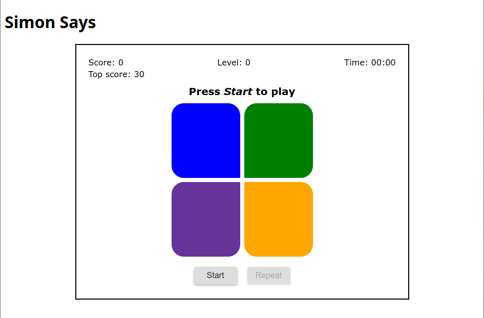

# Simon Says

Watch, Remember, Repeat!

`<simon-says>` is a dependency-free web component for the game [Simon Says][simon-says].



## Gameplay

A round in the game consists of the device lighting up one or more buttons in a random order, after which the player must reproduce that order by pressing the buttons. As the game progresses, the number of buttons to be pressed increases.

## How to play

1. Start a server in the root directory of this repository:
```bash
$ cd simon-says
$ python -m http.server
```
2. Open the web app in any browser of your choice:
```bash
$ firefox localhost:8000
```
3. Press _Start_.

## How to use in your website

To embed this in your website, insert the following into your HTML code:
```html
<script type="module" src="github"></script>
<simon-says></simon-says>
```

## License

[MIT][mit]

[simon-says]: https://en.wikipedia.org/wiki/Simon_Says "Simon Says - Wikipedia"
[simon]: https://en.wikipedia.org/wiki/Simon_(game) "Simon (game) - Wikipedia"
[mit]: https://choosealicense.com/licenses/mit/ "MIT License"
